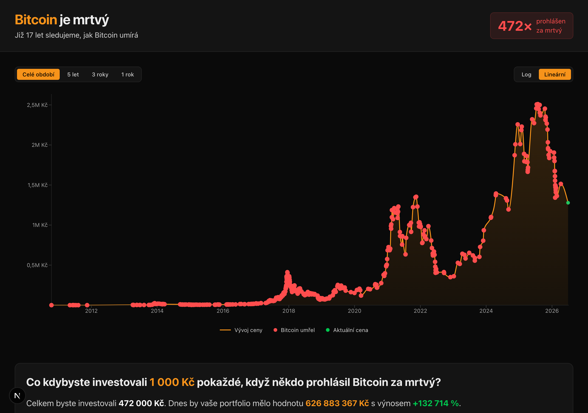

# Bitcoin je mrtvý 💀

> How many times has Bitcoin been declared dead — and yet it keeps running.

[](https://www.bitcoinjemrtvy.cz)
[](https://nextjs.org)
[](https://react.dev)
[](https://www.typescriptlang.org)
[](https://tailwindcss.com)
[](./LICENSE)

**Bitcoin je mrtvý** (Czech for *"Bitcoin is dead"*) is a Czech-language site that collects
Bitcoin "obituaries" from [bitcoindeaths.com](https://bitcoindeaths.com) and translates them
into Czech. Every time the media declares Bitcoin dead, it shows up as a marker on the BTC
price chart — right next to a running tally of how much you'd have today if you had bought
the dip on each one.

**→ [www.bitcoinjemrtvy.cz](https://www.bitcoinjemrtvy.cz)**



## Features

- 📈 **BTC price chart** with every "death" marked — switch the range (3 years, 5 years, all-time) and toggle linear vs. log scale.
- 🧮 **Interactive investment calculator** — set how much you'd buy on each death declaration (1–9,999 Kč) and the whole section recomputes live.
- 🛏️ **"Cash under the mattress" counterpoint** — the same deposits held in cash and eroded by Czech inflation, to show what's actually dying.
- 🗓️ **Chronological timeline** of every obituary, with the original quote and a link to the source article.
- ⏳ **Bitcoin age counter** ticking up from the genesis block (3 January 2009).
- 🧩 **Embeddable widgets** (Death Counter, Stats Card) at [`/embed`](https://www.bitcoinjemrtvy.cz/embed) — copy a one-line `<iframe>` snippet.
- 🇨🇿 **Automatic Czech translation** of new articles through the Claude API.
- ♿ Built for accessibility (WCAG AA contrast) and performance (ISR, lazy-loaded chart and analytics).

## Tech stack

Next.js 16 (App Router) · React 19 · TypeScript · Tailwind CSS 4 · Recharts · pnpm · deployed on Vercel.

## Development

Requires Node and [pnpm](https://pnpm.io) (pinned via `packageManager` + Corepack).

```bash
pnpm install
pnpm dev      # dev server (Turbopack)
pnpm build    # production build (from committed data)
pnpm lint     # ESLint
pnpm test     # node:test — pure functions (calculations, translation core, embed config)
```

Data is kept fresh by a daily GitHub Action, but the scripts can be run by hand:

```bash
node scripts/sync-deaths.mjs        # refresh deaths.json from bitcoindeaths.com
node scripts/fetch-source-urls.mjs  # refresh source-urls.json
```

## How it works

**Data flow.** Death records are fetched live from bitcoindeaths.com at runtime (ISR), with a
fallback to the static `src/data/deaths.json`. Czech titles and quotes live in
`src/data/translations-cs.json`; records without a translation are hidden entirely, so no
English slug is ever generated.

**Automatic translation.** New articles are translated by a daily GitHub Action
([`.github/workflows/translate.yml`](.github/workflows/translate.yml)) via the Claude API. It
commits one record at a time, never overwrites existing (hand-edited) translations, and has a
threshold guard against runaway cost.

**Prices.** The BTC price and the USD/CZK rate each use a multi-source fallback chain
(Kraken → Coinbase → CoinGecko; Frankfurter → ČNB). Every amount is stored in USD and
converted to CZK only at render time. The investment maths is linear in the per-event amount,
so the interactive calculator simply scales the server-computed base values on the client —
the full dataset never ships to the browser.

**Inflation.** The "cash under the mattress" comparison builds a purchasing-power index from
annual Czech inflation rates (`src/data/inflation-cz.json`, source: ČSÚ).

Architecture, conventions, and gotchas (slug generation, Recharts quirks, the server/client
component split) are documented in [`CLAUDE.md`](./CLAUDE.md).

## License

The **application source code** is licensed under [MIT](./LICENSE) — © 2026 Adam Kolek.

The obituary **data** (titles, quotes, links) comes from
[bitcoindeaths.com](https://bitcoindeaths.com) and belongs to its authors; the MIT license
does not cover it.

## Credits

Built on data from [Bitcoin Obituaries (bitcoindeaths.com)](https://bitcoindeaths.com).
Czech translation and adaptation by [Adam Kolek](https://www.linkedin.com/in/adamkolek/).

> ⚠️ Not investment advice. The site exists to entertain and to educate about media predictions.
